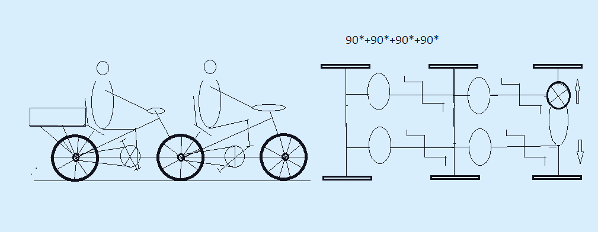

markdown

html

markdown

 

# 🔋 quad-phase-amphibio: 4-Person Amphibious Energy-Velomobile An ultra-reliable, modular 4-operator hybrid energy velomobile built for extreme long-distance expeditions, off-grid power harvesting, and tactical tourism. Designed by **@o2-qrz & Google Gemini AI** (50/50 Co-Authorship Protocol). --- ## 🛠️ Project Identity & Tech Stack * **Core Architecture:** 4-Phase Interconnected Crankshaft System (90° Phase Shift Alignment) * **Energy Core:** Native 48V LiFePO4 Buffer Battery Pack & Sealed Multi-Voltage DC-DC Matrix * **Chassis Class:** Aerospace-Grade 6061-T6 Aluminum Amphibious Frame with IP67 Waterproofing * **Propulsion System:** 500W Combined Driving Motor / Regenerative Smart Hub Generator * **Keywords / Tags:** `velomobile` `4-phase-crankshaft` `amphibious-chassis` `muscle-power-harvesting` `dc-dc-matrix` `open-source-hardware` `expedition-survival` --- ## 📊 Sustained Incline (10% Gradient): Solo Cyclist vs. 4-Phase Velomobile On long, steep inclines, aerodynamic momentum and rolling inertia drop to zero. The entire kinetic efficiency depends solely on the continuity of torque transmission. | Comparison Criteria | 🚴‍♂️ Solo Cyclist (Standard Bike) | 👥 4-Phase Velomobile (Our System) | Physical & Biomechanical Meaning | | :--- | :--- | :--- | :--- | | **Total System Mass** | ~105 kg (Rider + lightweight bike) | ~420 kg (4 Crew members + ruggedized chassis) | The velomobile is heavier, but the per-person power-to-weight efficiency completely offsets the mass penalty. | | **Torque Ripple (Power Gaps)** | **Critical (ranging from 0% to 100%)** | **0% (Absolute monolithic torque flow)** | The solo rider suffers from constant jerky motion; the 4-phase shaft moves smoothly, mimicking an electric motor. | | **6 o'clock & 12 o'clock Positions** | Power drops to absolute zero. The bike instantly attempts to roll backward down the slope. | Ignores dead centers entirely. The shaft is continuously driven by the power stroke of the other operators. | Complete elimination of the gravitational power gap without the need for high-speed forward momentum. | | **Muscle Fatigue (Lactic Acid)** | **Ultra-fast** due to peak anaerobic bursts (up to 300W) required to punch through dead zones. | **Minimal**, as all operators work in a steady, sustainable aerobic zone (~120W per person). | Muscles do not experience micro-shocks or sudden spikes; the crew can converse easily during the climb. | | **Uphill Tactical Outcome** | Forced to dismount and push the bike by hand, dropping speed to a grueling 1.5–2 km/h. | Maintains steady "tractor-like" momentum on a low-gear ratio at a stable **3.77 km/h**. | Achieving full uphill mobility on critical incline profiles without stopping or over-exhausting the crew. | --- ## 📐 Short Tactical & Technical Specifications 1. **"Carousel" Rotation Scheme (3 Pedaling, 1 Resting On-the-Fly):** Delivers a stable cruising speed of **28–32 km/h** on flat terrain. Enables a continuous daily range of **up to 400 km** by cycling muscle recovery periods without halting the vehicle. 2. **Amphibious Protocol (River Crossing):** Modular 200-liter inflatable PVC pontoons attach directly beneath the aluminum frame. The entire power electronics core is sealed inside a rugged **IP67** vault. Water propulsion is driven via muscle rotation of the 4-phase shaft (coupled with paddle wheels or high-tread tires). 3. **Stationary Generation (Camp Mode):** The rear drive axle is decoupled from the terrain by deploying an integrated kickstand-jack, lifting the wheels 3 cm off the ground. With zero aerodynamic drag, a casual rotation by 3 resting crew members harvests ~180W of continuous DC power to recharge camp equipment. 4. **Direct Current Distribution (DC-DC Matrix):** Complete elimination of heavy, heat-generating 220V AC inverters and cooling fans. Available output rails include: **5V** (USB-C PD 100W for laptops/comms), **12V** (compressors/cooling), **24V** (anatomical thermal mats), **36V** (LEV auxiliary charging), and native **48V** (direct-arc welding / Starlink nodes). 

***
https://github.com/o2-qrz/Powered-Mobile-3
.....
https://github.com/o2-qrz/stealth-cato-bahes-1
